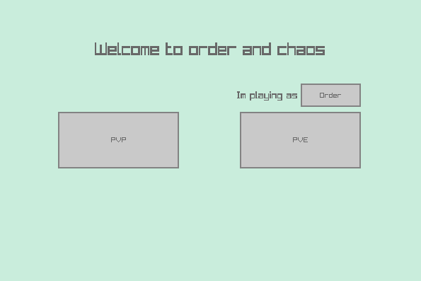
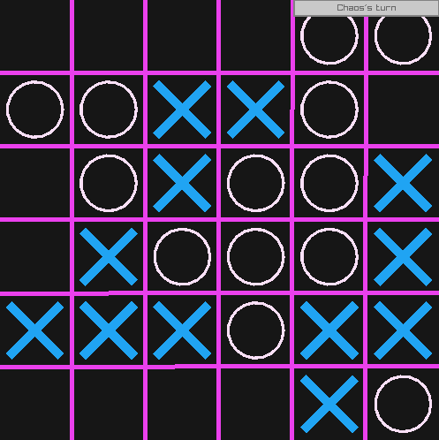
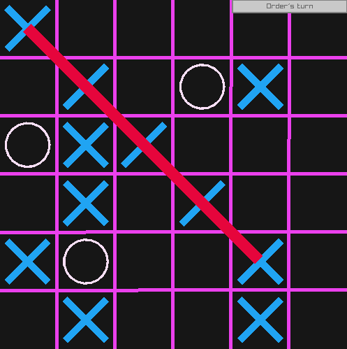

# Order and Chaos

by Elbergg

## Game rules

Order and Chaos is a tic-tac-toe variant in which one side plays as Order and the other (as you can guess) as Chaos.

Order's task is to get 5 X's or O's in a row, Chaos needs to stop him. Order always starts.

Both sides can place either an `X` or an `O`

Game page on wikipedia: (https://en.wikipedia.org/wiki/Order_and_Chaos)

## Overview

The player can choose between two different game modes:

- PVP: Challenge your friend into a gruesome fight! (Elbergg and co. isn't responsible for any damage caused by brawls between the raging participants)

- PVE: Try your luck against:
  
  - A random bot: as the name implies, he will choose his moves on random
  
  - An expert bot: an EVIL machine made with only one thing in mind - DEFEATING YOU! (It uses the Minimax algorithm with alpha beta pruning with the depth of 3,  so you will need to think 4 steps ahead to win, good luck!)

## Controls

They are preety simple:

-  left mouse button to place an `X` 

- right mouse button to place an `O`

## Libraries used

[Raylib]([GitHub - raysan5/raylib: A simple and easy-to-use library to enjoy videogames programming](https://github.com/raysan5/raylib)) and [Raygui]([GitHub - raysan5/raygui: A simple and easy-to-use immediate-mode gui library](https://github.com/raysan5/raygui)) were both used for creating the game UI

## Screenshots

The main menu:

The gameplay:

I hope you enjoy the game :)

                                - Elbergg